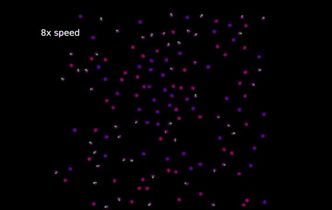

# Swarm-and-Multi-Robots
Brazil Nut Effect is the phenomenon that in a cereal packs under vibration, the largest particle, which is usually the Brazil nute, will end up at the top. Based on this kind of segregation pattern, it can be applied to the task of sorting a swarm and multi-robot system based on the artificial size assigned to the robots.

The implementation is based on this paper:
Chen, Jianing, et al. "Segregation in swarms of e-puck robots based on the brazil nut effect." Proceedings of the 11th International Conference on Autonomous Agents and Multiagent Systems-Volume 1. 2012.

The Coachswarm simulation is provided by Professor Michael Rubenstein at Northwestern University

Since this is a class project, the python code cannot be made public. If you are interested, please contact me for more details.

#### Approach

The robots in different colors represent different virtual body radius. The green robots have twice the radius of the red robots while the blue robots have three times the radius of the red robots. Each robot, no matter what color it is, will be governed by the same rule. The rule is defined by three vectors:

1. A gravitational pulling towards a common target (the center, in this case).
2. A random motion vector, which is the effect of vibration
3. A repulsive vector that moves away from neighbors, which is the effect of collision

#### Full Demo Video:
  
[Demo Video on Youtube](https://youtu.be/DbniXUkcucA)
  

#### Gif Demo:

